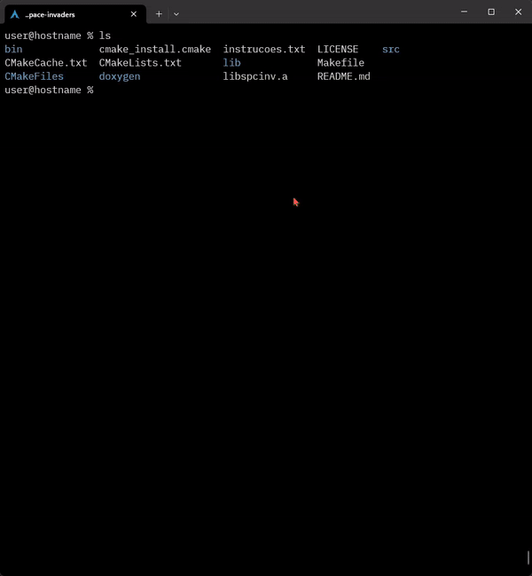

# Compiling:

    # Install sox (avaible in all major linux distros)
    pacman -S sox
    
    # Clone the repo
    git clone https://github.com/MatMercer/ncurses-space-invaders.git
    cd ncurses-space-invaders
    
    # Generate the build files and compile
    cmake .
    make
    # Play the game
    ./bin/spaceinvaders
    ./bin/spacedebug # Debug version

# About the project

Space Invaders is a game proposed as a college assignment for the teacher
[Augusto Luengo Pereira Nunes](http://www.inf.ufrgs.br/~alpnunes/index.html)
at the Federal Institute of Paraná Londrina. The game is inspired by [The Original Space Invaders](https://en.wikipedia.org/wiki/Space_Invaders) containing
all the same elements, less barriers.

# Code structure

## Boot Functions

Functions that begin with the name "init" are used to initialize the
components of the game, for example the `initAliens()` function allocates the
aliens and places them in the correct starting position. The startup main function
is the `initGame(),` which the ncurses starts.

## Main Game Loop

All functions are called within a loop ta the main loop in the function
`startSpaceInvaders()` and are divided into two categories:

* Game logic functions.
* Rendering Functions.

The `render()` function renders all the components of the game. Logic Functions
are called after `render()` within the `startSpaceInvaders()` function, this
causes independence between the rendering and physics of the game. The game works
even though one or all of the components are not rendered.

# Main Elements

## Borders / Scenery

The default character of the border is `*`. The edges are drawn centrally,
based on the window size (terminal) when running the game. If the window
is smaller than the minimum size set (90 characters wide and 45 characters wide
height characters), the borders will be drawn according to the mininum size.

The default border is yellow, in case the player loses a life the edge becomes
red and the character `*` is replaced by `X`. In case of victory, the border becomes green 
and the character `*` is replaced by `+`.
All characters in the game are printed bold on the screen and each component
has a different color.

## Aliens

The aliens move together and uniformly, automatically, after a
certain interval of time. This interval is based on a variable.
The movements start to the right and change the
horizontal direction after each collision with the lateral edges. In addition, the
aliens descend a vertical position after collisions.

Each alien has a boolean type variable that informs its state of life. The
aliens have three lasers, which are generated randomly with the same
movement interval of the aliens. Only the last alien in each
column can shoot.

## Player Spaceship

The starting position of the player is centered just above the bottom edge.
The player's ship is moved by the keyboard arrows, which control the
the player.

The laser in the player is activated with the space key and can can only
be shoot one at a time. The shooting ends with the
hit of an alien or a hit from the top edge.

## Sound

There are various sound effects in the game, which improve considerably
the user experience and even the gameplay. The 'M' key is used
to turn the game sounds on or off. The sounds are played with the
`playSound()` function. By default their format is a `.wav` and the
command to play has the following format:

    play -q {executable path} / sfx / {file name} {extension} &

The `getWorkingDirectory()` function is crucial for this command to work because it
finds the path of the executable. The final part of this `&` command causes
it to run on a differente proccess, preventing the game from pausing when a sound is
touched. The play command is available in different linux distributions by the
`sox` package. So the command to install this package on debian based distributions is simple:

    $ apt-get install sox

The sounds were generated by Gabriel Ranea from the website
[SuperFlashBros] (http://www.superflashbros.net/as3sfxr/).

## Score

The score is incremented by 10 points for each alien eliminated. The player can
score is in the upper right corner of the game and the final screen of
"Game over".

## Collisions

The collisions are detected from the `X` and `Y` positions of the items (aliens vs.
lasers) (player vs. lasers). For example, all aliens check
if a player's laser touched it, in case it occurs, it is no longer
rendered and does not move anymore.

## Lives

The player starts with 3 lives, which are shown in the upper left corner of the
screen. Every time the player suffers damage from a laser his life is
decremented by 1.

## Game over

The game can be closed in two ways, with the player winning or
losing. In both cases, an animated "Game Over" message is shown in the
screen, informing the score of the player and whether or not he won the game. The
player may choose to quit the game or restart.

### Victory

The player only wins if all aliens are eliminated. Verification is done
based on the player's score compared to the amount of aliens
multiplied by the score of each slaughtered alien. Ex: 25 aliens x 10 points =
250 points to win the game.

### Defeat

The player is defeated if:

* The player has no more lives. 
* Any alien touch the bottom edge.
* Any alien touch the player.

# Conclusion

The development of this game was very important to our experience.
because we had contact with technologies that we did not have prior knowledge.
Such as Makefile, CMake, Clion and Doxygen. In addition, due to the fact that this
program was made for Linux OS, we gained a deeper understanding of the
on how this system works.

